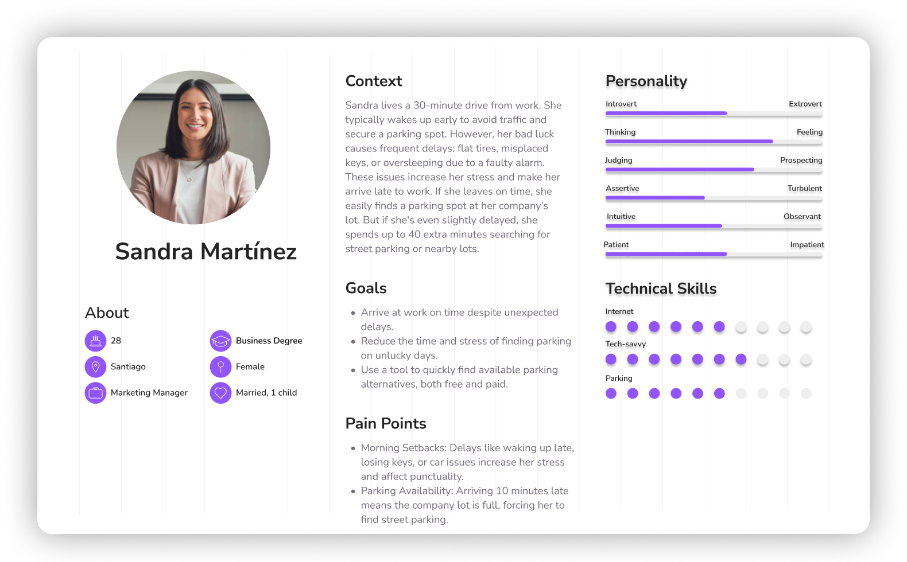

# ParkNow
User Experience Design Process for ParkNow – Find All Your Parking Solutions in One Place

## Index
- [Description](#description)
- [Strategy](#strategy)
- [Scope](#scope)
- [Structure](#structure)
- [Skeleton](#skeleton)
- [Surface](#surface)
- [Usability](#usability)
- [Team](#team)

---

## Description
The purpose of this project is to offer a didactic and practical instance of user experience design in the context of parking management and urban mobility.

The problem that is sought to be solved is the lack of integrated tools that help drivers not only find paid parking, but also identify streets or passages where free parking is allowed. Currently, drivers must rely on their knowledge of the city or on road signs, which can result in an inefficient and frustrating search. In addition, the lack of information on alternative routes to park complicates mobility in congested areas.

This project focuses exclusively on the design of the user experience and its elements, describing the strategy, scope, structure, skeleton and surface of the application.

The final objective is to develop a mobile application that facilitates both the visualization of paid parking options, along with the possibility of reserving a space and in turn free alternative places, optimizing the experience of drivers.

---

## Strategy
The strategy layer is based on user needs and expectations, and the Value Canvas plays an important role in this regard. By identifying the problems and pains drivers face (such as difficulty finding parking and lack of information about alternative options), the Value Canvas provides the basis for setting strategic goals.

This information allows us to define a value proposition that aligns with the user's challenges and shows how the application can address them
---

## Scope
After defining a clear strategy, it is essential to specify the scope of our application to ensure it effectively addresses users' needs. To this end, we have developed three user profiles that represent the different types of drivers the application is focused on. These profiles help us better understand their motivations, challenges, and expectations, which are key to adapting the application's features more effectively.

Below is the Customer Journey Map, which allows us to visualize a user's journey throughout their interaction with the application. This is essential for identifying key moments where the app can enhance the user experience, alleviate pain points, or reinforce the elements that work well.

Next, we conducted a benchmark that analyzes the competition in the market, allowing us to identify successes we want to emulate and mistakes we should avoid.

[Benchmark canvas: Full document here](files/BenchmarkCanvas.pdf)

 

---

## Structure
In this section, we present the app's sitemap, which shows the organization of the different sections and features. This allows us to visualize the navigation flow, so we can review and assess whether the main functionalities are easily accessible to the user.

---

## Skeleton
Wireframes allow us to create a basic visual representation of the app, without many graphic details, but with enough information to make adjustments in the content layout. This gives us the flexibility to make changes before moving on to more advanced stages of design.

- [Full document here](files/Wireframes.pdf)

---

## Surface
Mockups provide a more detailed and accurate representation of the final design of the application. Unlike wireframes, mockups incorporate graphic elements, colors, typography, and other visual details that give a clear vision of how the interface will look. At this stage, new details have been added, and greater emphasis has been placed on aesthetics, while still considering the functional importance of colors.

- [Full document of semiMockups here](files/semiMockups.pdf)
- [Full document of Mockups here](files/Mockups.pdf)
  
After conducting a usability and heuristic evaluation, as well as gathering feedback on the initial mockups, several iterations and adjustments were carried out. This process allowed for the identification of key improvement opportunities, resulting in the creation of the final mockups, which reflect a more intuitive, functional design aligned with user needs.

- [Full document of Final Mockups here]
---

## Usability  

As part of the user experience design process for Parknow, several improvements were implemented during a second design phase. This section outlines the results obtained and the key aspects addressed.  

### Usability Evaluation  

A heuristic evaluation was conducted by an external group, focusing on analyzing the usability of the application.  

This process helped identify issues in the quality of the proposed interface. The evaluation team highlighted several problems, prioritizing the most severe and critical ones.  

Based on these findings, the Parknow team implemented the necessary solutions and addressed the identified issues. Below are the key improvements made:  

- **Button Updates**: Updated the colors of the call-to-action buttons to improve clarity and avoid confusion about their functionality.  

- **Reservation Cancellation**: Added a mechanism for users to cancel reservations easily and quickly. 

- **User Location**: Integrated real-time user location display directly on the map.  

- **Schedules and Prices**: Enhanced functionality to display reservation prices and define schedules. Users can now switch between registered cards during payment.  

- **Icon Redesign**: Redesigned the icon and updated the section name to "Saved" to maintain aesthetic consistency throughout the application.

- **Saved Organization**: Optimized the "Saved" section by enabling custom groups to reduce visual clutter and improve organization.  

- **Navbar Adjustment**: Reorganized the navbar, reducing it to three main options and centering the map as the primary screen for users.  

- **Additional Details**: Expanded parking details and street descriptions, making prices more visible and adding brief references to assist navigation.  

- **Rating Method**: Implemented a feature for users to rate parking spots, improving interaction and trust in the platform.

- **Map Search**: Updated the map search bar with more descriptive text to guide users on its purpose and functionality.
  
---

## Team
- Enzo Loren
- Samuel Álvarez
- Fabián Matus
- Germán Lagos 
- Felipe Monsalves
